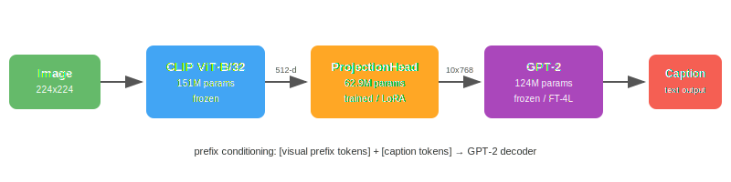
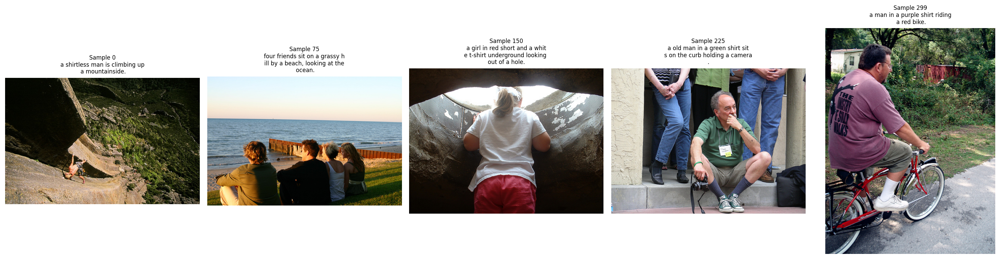

# IE7615 Generative Project — Image Captioning with CLIP + GPT-2

**Course:** IE7615 Neural Networks/Deep Learning SEC 02, Spring 2026

**Group 8:** Quoc Hung Le, Khoa Tran, Hassan Alfareed

## Overview

An image captioning system that combines OpenAI CLIP (ViT-B/32) as a visual encoder with GPT-2 as a language decoder. A learned ProjectionHead maps CLIP embeddings into GPT-2's input space via prefix conditioning, enabling visually-grounded caption generation.

## Architecture



The pipeline: Image (224x224) passes through frozen CLIP to produce a 512-d embedding. The ProjectionHead projects this into 10 prefix tokens (768-d each). These prefix tokens are prepended to GPT-2's input embeddings, conditioning the decoder on image content. GPT-2 then autoregressively generates the caption.

---

## Milestone 1 — Data Pipeline



*Five test images with ground-truth captions, CLIP embeddings, and GPT-2 tokenization.*

**Deliverables:** Flickr30k dataset (3,000 images, 2400/300/300 split), CLIP ViT-B/32 embeddings (512-d, L2-normalized), GPT-2 tokenization (vocab 50,257, max 50 tokens), 5 sample image-caption test runs, project proposal, GitHub repo initialized.

---


## Quick Start

```bash
git clone https://github.com/lequo-neu/IE7615_Generative_Project.git
cd IE7615_Generative_Project

# Environment (macOS M1 / Apple Silicon)
conda env create -f environment.yml
conda activate ie7615-captioning
# or: pip install -r requirements.txt

# Run notebooks in order
jupyter notebook notebooks/milestone1_data_pipeline.ipynb
```

M1 will download Flickr30k (~4GB first run), extract CLIP embeddings, and save them for M2-M4.

## Interactive Demo

Open `demo/index.html` in a browser for the full interactive results dashboard:
- **Gallery** — browse 300 test images with captions, filter by quality tier, click to expand
- **Model Comparison** — side-by-side metrics for Frozen vs FT-4L vs LoRA
- **Sensitivity** — interactive charts for temperature and beam width sweeps
- **Analysis** — failure breakdown, quality distribution, key findings

To export sample images for the demo gallery:
```bash
python scripts/export_demo_images.py
```

## Project Structure

```
Generative_Project/
├── README.md
├── environment.yml / requirements.txt
├── .gitignore
├── assets/                   README images
├── demo/                     Interactive HTML demo
│   ├── index.html
│   └── images/               (exported by script)
├── notebooks/
│   ├── milestone1_data_pipeline.ipynb
│   ├── milestone2_model_training.ipynb
│   ├── milestone3_evaluation.ipynb
│   └── milestone4_gallery.ipynb
├── data/
│   ├── raw/                  (gitignored)
│   ├── processed/
│   └── embeddings/           (gitignored)
├── src/
│   ├── data/ models/ training/ evaluation/ utils/
├── outputs/
│   ├── checkpoints/          (gitignored)
│   ├── figures/ samples/ gallery/
├── reports/                  (gitignored)
├── slides/
└── scripts/
```

## Tech Stack

PyTorch 2.10 (MPS) · HuggingFace Transformers 5.2 · PEFT (LoRA) · CLIP ViT-B/32 · GPT-2 (124M) · NLTK (BLEU, METEOR)

## Reproducibility

All experiments use seed=42 across Python, NumPy, PyTorch. Device auto-detects MPS > CUDA > CPU.

## License

Academic use only. IE7615, Northeastern University, Spring 2026.
